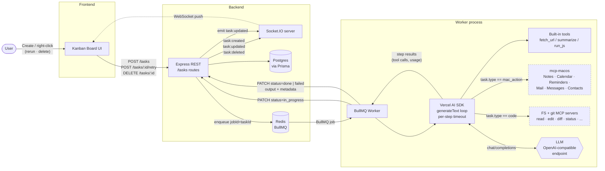

# AI Kanban

A production-ready MVP of an AI-powered Kanban board with autonomous agents.
Tasks created in the UI are pushed to a queue, picked up by a worker, and
executed by an AI agent (Vercel AI SDK) that uses tools to complete the work.
The board updates in real time over WebSockets.

## Architecture

```
Frontend (React + Vite + Tailwind)
   │  HTTP (REST)            ▲ WebSocket (Socket.IO)
   ▼                         │
Backend (Express + Prisma) ──┴── Socket.IO server
   │                         ▲
   ▼                         │ HTTP PATCH /tasks/:id
Postgres   BullMQ ──► Redis ─┴── Worker (BullMQ + Vercel AI SDK)
                                  └── tools: fetch_url, summarize, run_js
                                  └── optional MCP servers (mac / code)
```

### End-to-end workflow



The dashed boxes (`mcp-macos`, FS + git MCP servers) are **optional and gated by task type**: they're only exposed to the agent when `task.type` matches `MAC_TOOLS_TASK_TYPE` or `CODE_TASK_TYPE` respectively, so a `summarize` task can never reach AppleScript or your filesystem.

## Tech stack

| Layer    | Choice                                                      |
| -------- | ----------------------------------------------------------- |
| Frontend | React + TypeScript + Tailwind + Socket.IO client + Vite     |
| Backend  | Node.js + TypeScript + Express + Prisma + Socket.IO         |
| Database | PostgreSQL                                                  |
| Queue    | BullMQ + Redis                                              |
| Worker   | Node.js + BullMQ + **Vercel AI SDK v6** (`generateText`)    |
| Tools    | Zod-typed tools defined with `tool()` from `ai`             |
| Monorepo | pnpm workspaces + Turborepo                                 |

## Folder structure

```
ai-kanban/
├── apps/
│   ├── frontend/   # Vite + React + Tailwind
│   ├── backend/    # Express + Prisma + BullMQ producer + Socket.IO
│   └── worker/     # BullMQ Worker + Vercel AI SDK agent
└── packages/
    ├── types/      # Shared Task / TaskJobPayload / SOCKET_EVENTS
    └── tools/      # fetch_url, summarize, run_js (Vercel AI SDK tools)
```

## Setup

### Prerequisites

- Node.js 20+
- pnpm 9+ (`npm i -g pnpm`)
- Docker (for local Postgres + Redis)
- An OpenAI API key

### 1. Start Postgres & Redis

```bash
docker compose up -d
```

### 2. Install dependencies

```bash
pnpm install
```

### 3. Configure env files

```bash
cp apps/backend/.env.example apps/backend/.env
cp apps/worker/.env.example apps/worker/.env
cp apps/frontend/.env.example apps/frontend/.env
# then edit apps/worker/.env and set OPENAI_API_KEY
```

### 4. Run Prisma migration

```bash
pnpm --filter @ai-kanban/backend prisma:migrate --name init
```

### 5. Start everything

```bash
pnpm dev
```

Turborepo will start the backend (`:4000`), worker, and frontend (`:5173`) in
parallel. Open http://localhost:5173.

## REST API

| Method | Path                | Body                                 | Notes                                                |
| ------ | ------------------- | ------------------------------------ | ---------------------------------------------------- |
| `GET`  | `/tasks`            | —                                    | Lists all tasks                                      |
| `POST` | `/tasks`            | `{ title, description, type }`       | Creates task and enqueues a job                      |
| `PATCH`| `/tasks/:id`        | `{ status?, output? }`               | Used by the worker to report status                  |
| `POST` | `/tasks/:id/retry`  | —                                    | Resets a failed task to `todo` and re-enqueues a job |
| `GET`  | `/health`           | —                                    | Health check                                         |

WebSocket events (Socket.IO): `task:created`, `task:updated`.

## Task schema

```ts
type TaskStatus = "todo" | "in_progress" | "done" | "failed";
type TaskType   = "summarize" | "research" | "generate";

interface Task {
  id: string;
  title: string;
  description: string;
  type: TaskType;
  status: TaskStatus;
  output: string | null;
  metadata: TaskMetadata | null;
  createdAt: string;
  updatedAt: string;
}

interface TaskMetadata {
  model?: string;            // e.g. "gpt-4o-mini"
  steps?: number;            // generateText steps consumed
  durationMs?: number;       // wall-clock execution time
  startedAt?: string;
  finishedAt?: string;
  attempts?: number;         // 1-based attempt count
  toolCalls?: ToolCallLog[]; // ordered timeline of tool invocations
  usage?: { inputTokens?: number; outputTokens?: number; totalTokens?: number };
  finishReason?: string;     // "stop" | "tool-calls" | "length" | ...
  error?: { message: string; name?: string };
}
```

The `metadata` JSON column is set by the worker on every status transition, so
the **Done** column shows tool timeline + token usage + duration, and the
**Failed** column shows the error plus any partial tool calls that ran before
the failure. Click "Run details" on a card to expand.

## Agent + tools

`apps/worker/src/agent.ts` calls `generateText({ model, tools, stopWhen: stepCountIs(N) })`
from the Vercel AI SDK. There's no manual tool loop — the SDK handles
multi-step tool calling.

Tools live in `packages/tools/src`:

| Tool         | Purpose                                                       |
| ------------ | ------------------------------------------------------------- |
| `fetch_url`  | Fetches a webpage, strips HTML, returns plain text (10s cap). |
| `summarize`  | Heuristic summary of long text (lead + bullets).              |
| `run_js`     | Runs a small JS snippet inside a Node `vm` sandbox (2s cap).  |

Each tool uses `inputSchema` (Zod) and returns a structured object.

### Adding a new tool

1. Create `packages/tools/src/myTool.ts`:

   ```ts
   import { tool } from "ai";
   import { z } from "zod";

   export const myTool = tool({
     description: "What it does",
     inputSchema: z.object({ ... }),
     execute: async (args) => { ... },
   });
   ```

2. Export it from `packages/tools/src/index.ts` and add it to `agentTools`.
3. The worker will pick it up automatically.

## Constraints (MVP defaults)

| Concern                | Setting                                                     |
| ---------------------- | ----------------------------------------------------------- |
| Max steps per task     | `AGENT_MAX_STEPS=5` (via `stopWhen: stepCountIs(...)`)      |
| Max wall-time per task | `AGENT_TIMEOUT_MS=30000` (AbortSignal on `generateText`)    |
| Retries                | BullMQ `attempts: 3` with exponential backoff               |
| Concurrent tasks       | `WORKER_CONCURRENCY=3`                                      |
| Tool logging           | Each tool call printed + collected in `result.toolCalls`    |

## Example end-to-end flow

1. User opens http://localhost:5173 and clicks **+ New task**.
2. Submits:
   - **Title**: `Summarize this article and write a tweet`
   - **Type**: `summarize`
   - **Description**: `https://en.wikipedia.org/wiki/Kanban_(development) — give me a 3-bullet summary, then a single tweet under 240 chars.`
3. `POST /tasks` saves the task (`status=todo`) and enqueues a BullMQ job.
4. Backend emits `task:created` → card appears in **Todo**.
5. Worker picks up the job:
   - PATCHes `status=in_progress` → backend emits `task:updated` → card moves to **In Progress** with a pulsing indicator.
   - Calls `generateText` with the 3 tools and a structured prompt.
   - Model calls `fetch_url`, then `summarize`, then writes the final answer.
   - Worker PATCHes `status=done, output=<text>`.
6. Card moves to **Done**; click it to expand the agent output.

## Production notes

- **Worker isolation**: `apps/worker` is a separate process and can scale
  horizontally. BullMQ guarantees one consumer per job (we also pass
  `jobId: taskId` to dedupe re-enqueues).
- **Token budget**: `gpt-4o-mini` keeps cost tiny. Tools also cap their
  output (`fetch_url` → 200 KB, `summarize` → 30 KB input).
- **Sandboxing**: `run_js` uses `vm.Script` with `codeGeneration.strings: false`
  + a 2-second timeout. Not safe for untrusted multi-tenant code on its own;
  put behind a separate process / container if exposed publicly.
- **Failure mode**: If a job fails 3 times, the card lands in `failed` with the
  error message in `output` (visible by expanding the card).

## Scripts

```bash
pnpm dev                                  # all apps in parallel
pnpm --filter @ai-kanban/backend dev      # backend only
pnpm --filter @ai-kanban/worker dev       # worker only
pnpm --filter @ai-kanban/frontend dev     # frontend only
pnpm typecheck                            # all packages
pnpm db:migrate                           # prisma migrate dev
```
# autonomous-ai-task-scheduler
